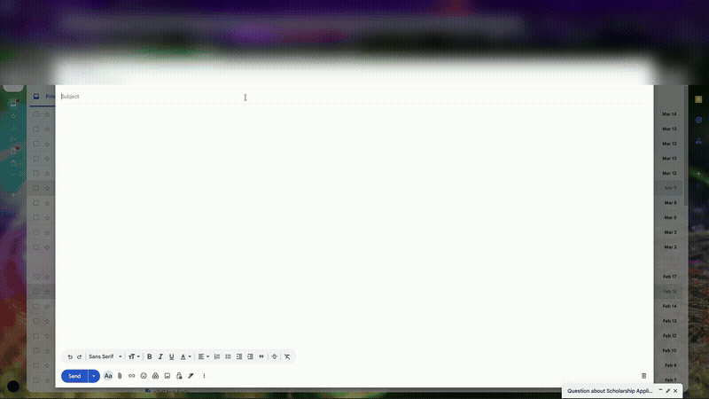
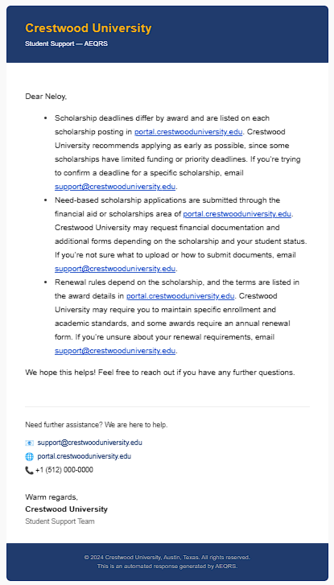

<div align="center">

# Automated Email Query Resolution System

### Intelligent FAQ-Driven Email Automation with Vector Search & LLM


</div>

## 📖 Overview

**Automatically manage your university inbox with an AI that reads student questions, matches them to your approved guidelines, and sends out friendly, consistent replies 24/7 so no one is left waiting.**

### ❌ The Problem

University admissions and support teams are often overwhelmed by their inboxes. Specifically:
- Staff spend countless hours manually reading and replying to the same questions over and over.
- Students are left waiting for answers because human teams can't be online 24/7.
- Different staff members might give slightly different answers to the exact same question.
- Valuable human time is wasted on basic FAQs instead of complex student issues that actually need personal attention.
- There’s no quick, reliable way to instantly match a student's email to the existing knowledge base.

### ✅ The Solution

<div align="center">
  
  <p><em>n8n workflow: Incoming email → Semantic search → LLM response → Threaded reply</em></p>
</div>

Think of this as a hyper-efficient, 24/7 assistant for your inbox. Here is how it works behind the scenes:

- **Stays up to date:** It quietly monitors a Google Drive FAQ file, automatically learning new answers as you update them.
- **Understands meaning:** It converts your FAQs into searchable data (vector embeddings), allowing it to understand the actual *intent* behind a student's question, not just exact keywords.
- **Reads and researches:** When an email arrives, it extracts the question and instantly searches the knowledge base for the perfect match.
- **Drafts the perfect reply:** Using an LLM, it writes a polite, personalized, and context-aware email response.
- **Keeps it natural:** It replies directly within the original email thread, exactly like a human would.

> 💡 **The result?** Once deployed, incoming questions are matched, answered, and resolved instantly—day or night—freeing your team up to focus on the work that matters most.

## ✨ Key Features

- 📂 **Google Drive Triggered Ingestion** — Automatically detects file changes in Google Drive and re-ingests updated FAQ data 
- 🧠 **Semantic Vector Embeddings** — Converts FAQ pairs into high-dimensional vectors using `mxbai-embed-large-v1` for accurate similarity matching
- 🗃️ **Self-Hosted Vector Database** — Stores and queries embeddings with Qdrant DB using Cosine distance and 1024-dimensional vectors
- 📬 **Real-Time Email Trigger** — Gmail trigger instantly picks up new incoming emails and kicks off the resolution pipeline
- 🔍 **Similarity Search with Threshold** — Retrieves the top 3 most relevant FAQ answers with a minimum score threshold of 0.7 for quality control
- 🤖 **Local LLM Response Generation** — Uses `llama-3.2-3b-instruct` via LM Studio to craft professional, personalised HTML email responses
- 💌 **Threaded Email Replies** — Replies are sent back within the same Gmail thread using the original Message ID for seamless conversation tracking
- 🔄 **Dynamic Collection Management** — Automatically handles Qdrant collection creation, deletion, and recreation on each ingestion cycle
- 🏠 **Fully Self-Hosted Architecture** — n8n, Qdrant, and LM Studio all run locally via Docker with no third-party AI API dependencies
- 💸 **100% Free & Open Source** — Built entirely on open-source tools with no ongoing AI inference costs

## 🛠️ Tech Stack

| Category | Technology | Description | Link |
|----------|------------|-------------|------|
| **Workflow Automation** | n8n Community Edition | Workflow orchestration for both the ingestion pipeline and response automation | [n8n.io](https://docs.n8n.io/hosting/) |
| **Vector Database** | Qdrant DB | Vector database for storing and querying FAQ embeddings | [qdrant.tech](https://qdrant.tech/) |
| **Embedding Model** | mxbai-embed-large-v1 | Text embedding model, producing 1024-dimensional vectors | [MxBai](https://huggingface.co/mixedbread-ai/mxbai-embed-large-v1) |
| **LLM** | llama-3.2-3b-instruct | Instruction-tuned LLaMA model for reply email | [LLaMA](https://huggingface.co/bartowski/Llama-3.2-3B-Instruct-GGUF) |
| **Model Host** | LM Studio | Hosts both the embedding model and LLM via OpenAI-compatible APIs | [lmstudio.ai](https://lmstudio.ai/) |
| **Email Service** | Gmail | Incoming email trigger and outbound threaded reply service  | [Gmail](https://mail.google.com/) |
| **File Storage** | Google Drive | Hosts the FAQ JSON file and triggers ingestion on file changes | [Google Drive](https://drive.google.com/) |
| **Containerization** | Docker + Docker Compose | Multi-container orchestration for n8n and Qdrant services via `docker-compose.yml` | [Docker](https://www.docker.com/) |

## 🔄 Automation Flow

### Part 1 — Knowledge Base Ingestion

```text
         Google Drive File Change Detected (Daily Trigger)
                              ↓
                   Google Drive Trigger
                              ↓
          ┌───────────────────┴───────────────────┐
          ↓                                       ↓
  [Collection Setup Branch]            [Data Ingestion Branch]
          ↓                                       ↓
  Fetch Collection Name                     Download File
          ↓                                       ↓
  Check If Collection Exists              Extract from File
          ↓                                       ↓
    ┌─────┴─────┐                            Data Fetch
    ↓           ↓                                 ↓
 Exists?   Not Exists?                   Data Preprocessing
    ↓           ↓                                 ↓
 Delete         |                       Embedding Generation
 Collection     |                                 ↓
    ↓           |                                 |
    └─────┬─────┘                                 |
          ↓                                       |
   Create Collection                              | 
          ↓                                       |
          └───────────────────┬───────────────────┘
                              ↓
                        Upsert Points
                              ↓
                    ✅ Ingestion Complete
```

---

### Part 2 — Email Query Resolution

```text
           New Email Received in Gmail Inbox
                           ↓
                    Gmail Trigger
                           ↓
                  Fields Preparation
                           ↓
          ┌────────────────┴────────────────┐
          ↓                                 ↓
   Query Embedding              Collection Name Fetch
          ↓                                 ↓
          └────────────────┬────────────────┘
                           ↓
                         Merge
                           ↓
                    Similarity Search
                           ↓
                    Message a Model
                           ↓
                      Email Format
                           ↓
                   Send Reply Email
                           ↓
               ✅ Response Sent to Sender
```

## 📋 Prerequisites

Before you begin, ensure you have the following set up:

---

### 🖥️ Software Requirements

| Software  | Version          | Purpose                                      | Installation Guide                                                   |
| --------- | ---------------- | -------------------------------------------- | -------------------------------------------------------------------- |
| Docker    | 28.5.1+          | Container runtime for services               | [Install Docker](https://docs.docker.com/get-docker/)                |
| n8n       | 1.121.3 (latest) | Workflow automation platform                 | [n8n Docker Setup](https://docs.n8n.io/hosting/installation/docker/) |
| LM Studio | 0.3.36+          | Local LLM hosting with OpenAI-compatible API | [Download LM Studio](https://lmstudio.ai/)    

**Verify Installation:**

```bash
# Check Docker
docker --version
# Expected: Docker version 28.0.0 or higher
```

---

### 🤖 LM Studio Setup

Two models need to be loaded in LM Studio:

#### Embedding Model

| Requirement | Details |
|-------------|---------|
| Model | mxbai-embed-large-v1 |
| Format | GGUF |
| Server Port | 1234 (default) |
| Base URL | `http://<LM_STUDIO_IP>:1234/v1/embeddings` |
| Output Dimensions | 1024 |

#### LLM

| Requirement | Details |
|-------------|---------|
| Model | llama-3.2-3b-instruct |
| Format | GGUF |
| Server Port | 1234 (default, shared server) |
| Base URL | `http://<LM_STUDIO_IP>:1234/v1` |

**Setup Steps:**

- [ ] Download and install LM Studio
- [ ] Download `mxbai-embed-large-v1` model (GGUF)
- [ ] Download `llama-3.2-3b-instruct` model (GGUF)
- [ ] Load models in LM Studio
- [ ] Start the local server (default port: `1234`)
- [ ] Note your machine's local IP address where LM Studio server is running to use as `<LM_STUDIO_IP>` in the Base URL

> 📘 **Guide:** [LM Studio Local Server Setup](https://lmstudio.ai/docs/developer/core/server)

---

| Service | Free Tier | Signup / Setup |
|---------|-----------|----------------|
| Google Cloud Console | ✅ Yes (with limits) | [Setup Guide](https://console.cloud.google.com/) |
| Gmail | ✅ Yes | Enabled via Google Cloud |
| Google Drive | ✅ Yes | Enabled via Google Cloud |
| Qdrant DB | ✅ Yes (Docker) | Included via Docker Compose |
| n8n | ✅ Yes (Docker) | Included via Docker Compose |

---

### 🔑 Credentials Checklist

Ensure you have the following credentials ready before configuring n8n:

#### Google (Gmail & Drive)
- [ ] OAuth 2.0 Client ID
- [ ] OAuth 2.0 Client Secret
- [ ] Enabled APIs: Gmail, Google Drive

> 📘 **Guide:** [Setting up Google OAuth for n8n](https://docs.n8n.io/integrations/builtin/credentials/google/oauth-single-service/)

> 💡 **Note:** The same Client ID and Client Secret can be used for both the Gmail and Google Drive credentials in n8n. You do not need to create separate OAuth 2.0 credentials for each service.

#### Qdrant DB
- [ ] API Key: *(optional, leave blank for self-hosted)*
- [ ] REST URL: `http://host.docker.internal:6333`
- [ ] Allowed HTTP Request Domains: `All`

#### OpenAI Node (LM Studio)
- [ ] API Key (can be any string, e.g., `lm-studio` or dummy key)
- [ ] Base URL: `http://<LM_STUDIO_IP>:1234/v1`
- [ ] Organization ID: *(optional, leave blank)*
- [ ] Allowed HTTP Request Domains: `All`

> ⚠️ **Note:** Since you're using LM Studio locally, the API Key can be any placeholder value. The Base URL must point to your LM Studio server.

---

### 📁 FAQ JSON File Format

The FAQ data file hosted on Google Drive must follow this structure:

```json
{
  "data": [
    {
      "id": 1,
      "topic": "Admissions and Applications",
      "question": "How do I apply to Crestwood University, and is there an online application?",
      "answer": "You can apply to Crestwood University by completing the online application through the student portal at portal.crestwooduniversity.edu. After you submit the form, you’ll be prompted to upload required documents and provide any additional information needed. If you run into issues accessing the application, contact support@crestwooduniversity.edu for assistance."
    },
    {
      "id": 2,
      "topic": "Admissions and Applications",
      "question": "When are the application deadlines for fall and spring?",
      "answer": "Application deadlines vary by term and program, so the most accurate dates are posted in the admissions section of portal.crestwooduniversity.edu. Crestwood University recommends submitting your application well before the posted deadline to allow time for document review. If you need help confirming the deadline for your program, email helpdesk@crestwooduniversity.edu."
    }
  ]
}
```

| Field | Type | Description |
|-------|------|-------------|
| `id` | Integer | Unique identifier for the FAQ entry |
| `topic` | String | Category/topic the question belongs to |
| `question` | String | The FAQ question |
| `answer` | String | The corresponding answer |

> ⚠️ **Important:** The embedding is generated from `[topic] question` format (e.g., `[Admissions and Applications] When are the application deadlines for fall and spring?`). Ensure topics are concise and descriptive.

---

### 🌐 Network Configuration

| Service | Local URL | Port | Access Method |
|---------|-----------|------|---------------|
| n8n | `http://localhost:5678` | 5678 | Browser |
| Qdrant Dashboard | `http://localhost:6333/dashboard` | 6333 | Browser Dashboard |
| LM Studio | `http://<LM_STUDIO_IP>:1234/v1` | 1234 | API only |

> ⚠️ **Important:** Use your machine's actual local IP (e.g., `192.168.1.x`) in the LM Studio Base URL — not `localhost` — as Docker containers resolve `localhost` to themselves, not your host machine.

## 🚀 Quick Start

### 1️⃣ Clone the Repository

```bash
# Clone the repo
git clone https://github.com/Neloy-Barman/Automated-Email-Query-Resolution-System

# Navigate to the project directory
cd Automated-Email-Query-Resolution-System
```

---

### 2️⃣ Configure Environment Variables

Create a `.env` file in the project root:

```bash
cp .env.example .env
```

Edit `.env` with your values:

```env
# Automated-Email-Query-Resolution-System
QDRANT_COLLECTION=<collection_name>
```

> ⚠️ **Important:** The `QDRANT_COLLECTION` value is referenced by the workflow. Ensure it is consistent.


---

### 3️⃣ Start Docker Containers

Ensure Docker Desktop is running, then start all services:

```bash
docker compose up -d
```

This will spin up:

| Service | URL | Purpose |
|---------|-----|---------|
| n8n | `http://localhost:5678` | Workflow automation platform |
| Qdrant | `http://localhost:6333` | Vector database |

---

### 4️⃣ Start LM Studio Server

1. Open **LM Studio** application
2. Load `mxbai-embed-large-v1` model
3. Load `llama-3.2-3b-instruct` model
4. Navigate to the **Local Server** tab
5. Click **Start Server** (default port: `1234`)
6. Note your machine's IP address (e.g., `192.168.56.1`)

> ⚠️ Keep LM Studio running throughout usage. Both workflows depend on the local server being active.

---

### 5️⃣ Access n8n Interface

Open your browser and navigate to:

```
http://localhost:5678
```

Create an account or log in if prompted.

---

### 6️⃣ Import the Workflow

Both the **Knowledge Base Ingestion** and **Email Query Resolution** pipelines are combined in a single workflow file.

1. From the **Home** page, click the **Create Workflow** button (top-right corner)
2. Once the workflow canvas opens, click the **`...`** menu (top-right corner)
3. Select **Import from File**
4. Choose `Automated-Email-Query-Resolution.json` from the project directory

---

### 7️⃣ Configure Credentials in n8n

> 📘 All credentials can be configured from the same path: **Home → Credentials → Add Credential**. Select the respective credential service from the list below.

| Credential | Service to Select | Required Values |
|------------|------------------|-----------------|
| **Gmail** | Gmail OAuth2 API | Client ID, Client Secret |
| **Google Drive** | Google Drive OAuth2 API | Client ID, Client Secret |
| **Qdrant** | Qdrant API | REST URL: `http://host.docker.internal:6333` |
| **LM Studio** | OpenAi | API Key: any placeholder value<br>Base URL: `http://<LM_STUDIO_IP>:1234/v1`|

> 📘 Refer to [Prerequisites → Credentials Checklist](#-credentials-checklist) for detailed setup instructions.

---

### 8️⃣ Update Workflow Parameters

**Credentials:**

| Credential | Nodes |
|------------|-------|
| **OpenAi** | Message a model |
| **Gmail OAuth2 API** | Gmail Trigger, Send Reply Email |
| **Google Drive OAuth2 API** | Google Drive Trigger, Download File |
| **QDrant API** | Check If Collection Exists, Delete Collection, Create Collection, Upsert Points, Similarity Search |

**Parameters:**

| Node | Parameter | Value |
|------|-----------|-------|
| **Google Drive Trigger** | File | By ID → Your FAQ JSON File ID |
| **Download File** | File | By ID → Your FAQ JSON File ID |
| **Embedding Generation** | URL | http://<LM_STUDIO_IP>:1234/v1/embeddings |
| **Query Embedding** | URL | http://<LM_STUDIO_IP>:1234/v1/embeddings |

---

### 9️⃣ Activate the Workflows

1. Toggle the **Active** switch in the top-right corner
2. Status should show **Active** (green)

---

### ✅ Setup Complete!

Your system is now live. Upload or update your FAQ JSON file in Google Drive and send a test email to your configured Gmail address to see the pipeline in action! 🎉

> 💡 Head over to [📘 Usage](#-usage) to learn how to test and manage the system.

## 📘 Usage

### 🎯 User Entry Points

| User Type | Entry Point | Purpose |
|-----------|-------------|---------|
| **Admin** | Google Drive (FAQ file) | Update FAQ knowledge base |
|  | n8n Interface (`localhost:5678`) | Monitor and manage workflows |
|  | Qdrant Dashboard (`localhost:6333/dashboard`) | Inspect stored vector points |
| **End User** | Email (Gmail address) | Send queries to the system |

---

### 1️⃣ Updating the Knowledge Base

To update the knowledge base, simply edit and save the FAQ JSON file in Google Drive.

The ingestion workflow runs **daily** and will automatically detect changes:

1. Log in to [Google Drive](https://drive.google.com/)
2. Navigate to your FAQ JSON file
3. Edit the file — add, update, or remove FAQ entries
4. Save the file
5. The n8n workflow will detect the change and re-ingest all data

**FAQ Entry Format:**

```json
{
  "id": 64,
  "topic": "Scholarships",
  "question": "If my GPA drops, will I lose my scholarship right away?",
  "answer": "Many scholarships require a minimum GPA and may be reviewed at the end of each term or academic year based on the scholarship’s terms. Crestwood University will notify you through portal.crestwooduniversity.edu if your award is at risk or if a probation period applies. If you’re concerned about your current standing, contact support@crestwooduniversity.edu to review your scholarship conditions."
}
```

> 💡 **Tip:** The `topic` field directly influences embedding quality. Use clear, consistent topic names like `Admissions and Applications`, `Fee Payment and Financial Aid`, `Course Registration and Academics` etc.

---

### 2️⃣ Sending Queries via Email

End users simply send an email to the configured Gmail address:

| Field | Example |
|-------|---------|
| **To** | `university-faq@gmail.com` |
| **Subject** | `Question about scholarship application` |
| **Body** | `Hi, I wanted to know when scholarship applications open and what the requirements are. Thank you.` |

---

### 3️⃣ Testing the Workflow

**Test the Knowledge Base Ingestion Pipeline:**

1. Ensure LM Studio server is running with both models loaded
2. Open n8n at `http://localhost:5678`
3. Open the workflow canvas
4. Click **Execute Workflow (from Google Drive Trigger)** to trigger a manual run
5. Verify each node executes successfully (green checkmarks)
6. Visit `http://localhost:6333/dashboard` to confirm vectors were upserted

**Test the Email Query Resolution Pipeline:**

1. Send a test email to your configured Gmail address
2. Monitor the workflow execution in n8n
3. Verify the reply arrives in your inbox

---

### 4️⃣ Expected Outputs

**Knowledge Base Ingestion — Success Indicators:**

| Check | Location | What to Expect |
|-------|----------|----------------|
| Collection created | Qdrant Dashboard | Collection named as per `QDRANT_COLLECTION` in `.env` |
| Points upserted | Qdrant Dashboard → Collection → Points | All FAQ entries visible as vector points |
| Payload stored | Click any point | `id`, `topic`, `question`, `answer`, `embeddingText` fields present |

**Email Query Resolution — Success Indicators:**

| Check | Location | What to Expect |
|-------|----------|----------------|
| Workflow execution | n8n Execution History | All nodes green, no errors |
| Similarity results | `Similarity Search` node output | 1–3 results with scores ≥ 0.7 |
| LLM response | `Message a Model` node output | HTML-formatted email content |
| Reply received | Sender's inbox | Formatted HTML reply within original email thread |


**Sample Reply Email:**

> 💡 Below is a sample automated reply email generated by the system in response to an incoming query.

<div align="center">



</div>


---

### 5️⃣ Managing the System

**View live container logs:**

```bash
# All services
docker compose logs -f

# n8n only
docker compose logs -f n8n

# Qdrant only
docker compose logs -f qdrant
```

**Stop all services:**

```bash
docker compose stop
```

---

## 📄 License
This project is licensed under the [MIT License](https://opensource.org/licenses/MIT) — see the [LICENSE](LICENSE) file for details.

## 👤 Author

**Neloy Barman** – Agentic AI Engineer **|** Automation Specialist **|** Chatbot Developer

- 💼 LinkedIn: [Neloy Barman](https://www.linkedin.com/in/neloy-barman/)
- 🐙 GitHub: [Neloy-Barman](https://github.com/Neloy-Barman)
- ✍️ Medium: [@neloyupwork018](https://medium.com/@neloyupwork018)
- 🌐 Portfolio: [neloy-barman.github.io](https://neloy-barman.github.io/)
- 📧 Email: [neloyupwork018@gmail.com](mailto:neloycareer018@gmail.com)

---

Built with ☕ and automation in mind by [Neloy Barman](https://github.com/Neloy-Barman)

<div align="center">
<sub>📝 Documentation crafted with assistance from <a href="https://claude.ai"><span style="color: #da7756">Claude Sonnet 4.6</span></a></sub>
</div>
